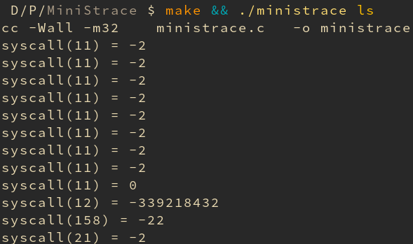

# MiniStrace
## A simple implmentation of linux syscall tracer

### Description
ministrace is a simple implementation of linux strace which trace the system calls made by any application. Ministrace at its current state prints the syscall number for the system call which are made by the application.

### Demo

### Todo
1. Convert the syscall numbers to human readable string
2. Improve functionality